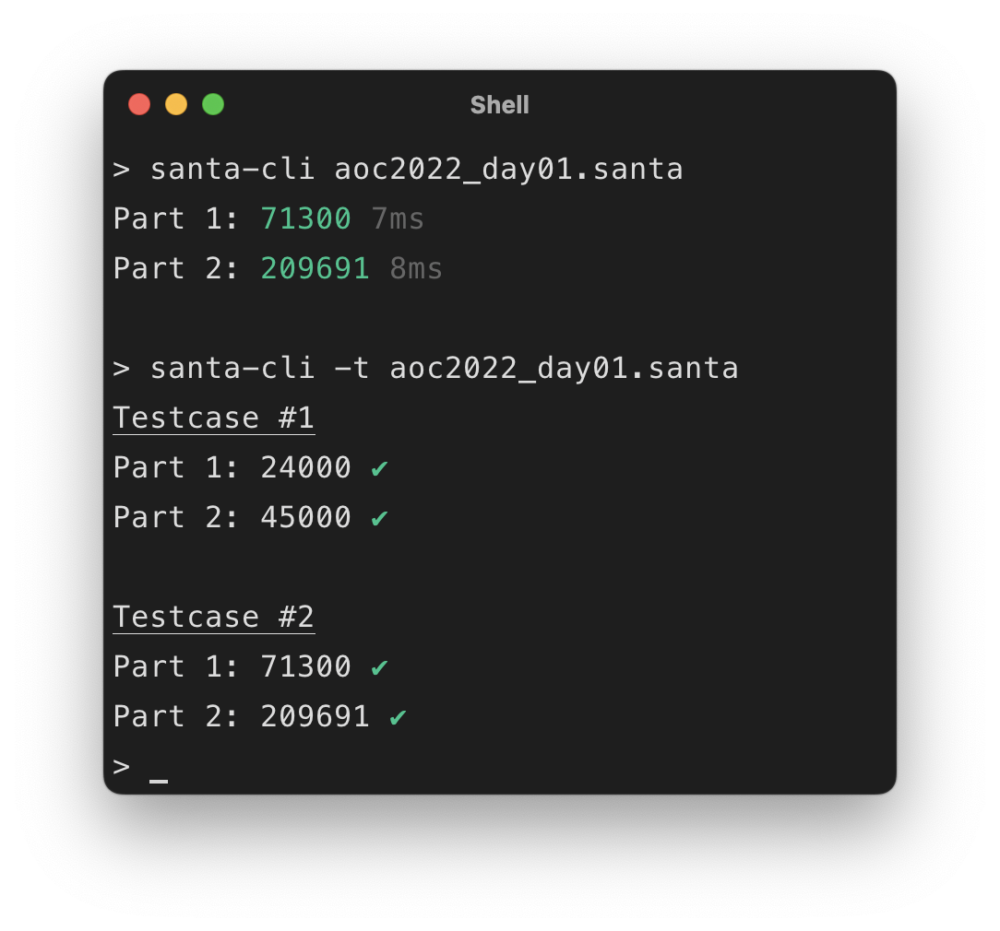
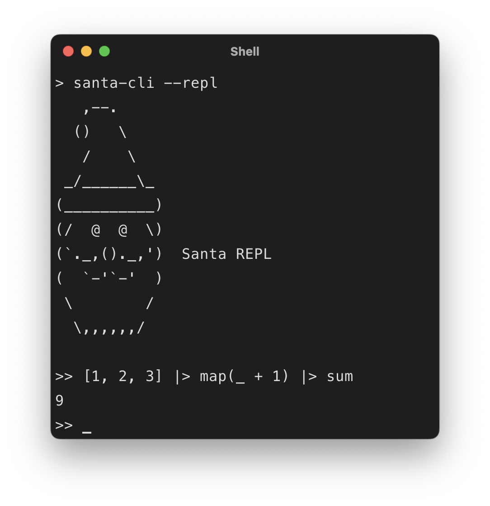
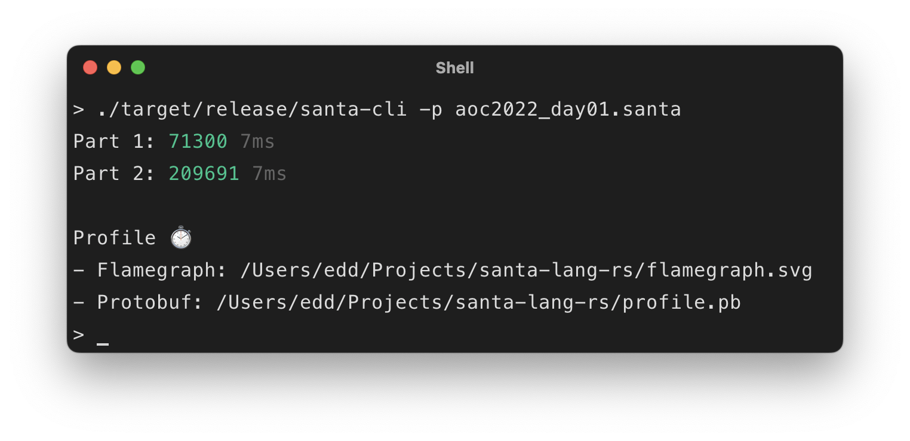

# CLI

[](https://github.com/eddmann/santa-lang-rs/tree/main/runtime/cli) [](https://github.com/eddmann/santa-lang-ts/tree/main/src/cli)

This runtime provides the ability to access the language/runner via a Command Line Interface (CLI).
It includes the following functionality:

- Execute a given solution's source file, providing benchmark timing for each defined part.
- Execute a given solutions source files test suite.
- Execute a given script source file.
- (Rust only) Load an interactive REPL environment, which can be used to quickly explore the language.

## Release

| Platform     | Release                                             |
| ------------ | --------------------------------------------------- |
| Linux/GNU    | [`santa-lang-cli-0.0.1-x86_64-unknown-linux-gnu`]() |
| Apple/Darwin | [`santa-lang-cli-0.0.1-x86_64-apple-darwin`]()      |
| Docker/x86   | [`eddmann/santa-lang-cli:0.0.1`]()                  |

**Note:** the TypeScript implementation can be accessed via the [GitHub repository](https://github.com/eddmann/santa-lang-ts).

<figure markdown>
  { align="left", width="46%" }
  { align="right", width="46%" }
</figure>

## External Functions

The CLI provides three runtime specific functions, these are:

### puts

```
puts(..value)
```

Prints the supplied values (using their display format) to _stdout_.

```
puts("Hello", [1, 2.5, true])
```

### read

```
read(path)
```

Reads the contents of the given path into a String.
The path can either be:

- A local directory path, absolute or relative to the source file.
- Based on a `http(s)` schema being defined; a web URL location.
- Based on a `aoc` schema being defined; a specific Advent of Code problem input (i.e. `aoc://2015/1`).
  In this case an external `SANTA_CLI_SESSION_TOKEN` environment variable must be defined which includes a valid Advent of Code session token.
  This can be extracted from the cookie set upon successful login to the [platform](https://adventofcode.com/).

=== "Local"

    ```
    read("input.txt")
    ```

=== "URL"

    ```
    read("https://www.example.com/input.txt")
    ```

=== "AoC"

    ```
    read("aoc://2015/1")
    ```

### env

```
env()
```

(REPL only) Prints the current environment's variables

## Profiling

The Rust-based CLI can be built locally (via a Cargo [`profile`](https://github.com/eddmann/santa-lang-rs/blob/main/runtime/cli/Cargo.toml#L26) feature flag) with additional [flamegraph](https://github.com/tikv/pprof-rs#flamegraph)/[pprof](https://github.com/tikv/pprof-rs#use-with-pprof) CPU profiling output for a given solutions' execution.
This can be useful when trying to determine slow areas of a given solution, to improve its overall performance.

<figure markdown>
  { width="600" }
</figure>
