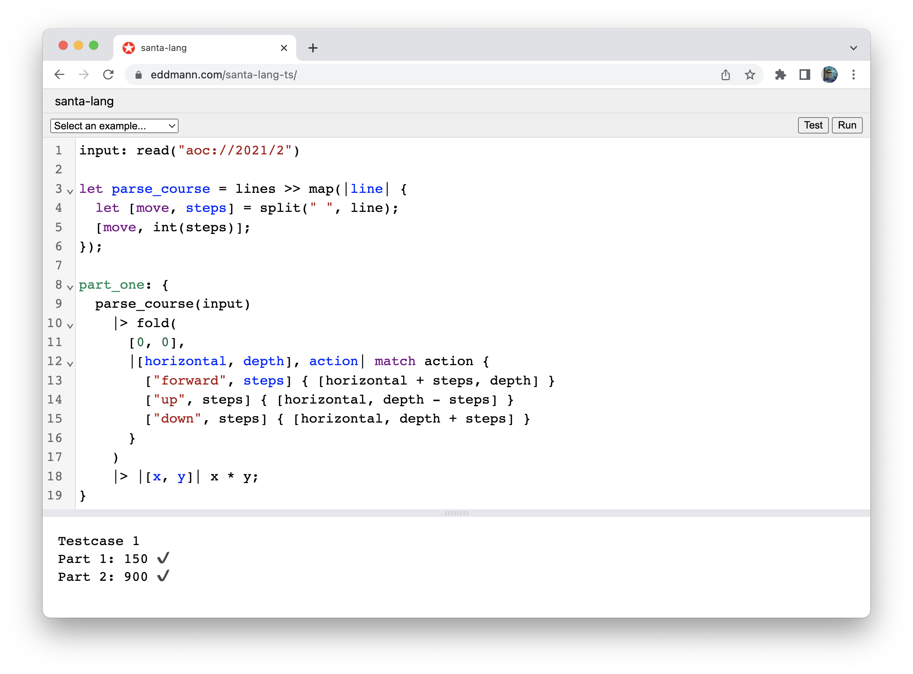

# Web

[](https://github.com/eddmann/santa-lang-rs/tree/main/runtime/wasm) [](https://github.com/eddmann/santa-lang-ts/tree/main/src/web)

The Web runtime is accessible via WebAssembly (WASM) within the Rust implementation, and bundled JavaScript within the TypeScript implementation.
This enables the interpreter to be run within the Browser, Web Worker and Node environments.
As expected, the WASM variant is more performant that the JavaScript implementation, due to being compiled to a lower-level language.
This variant is also used to execute the runnable examples found within this documentation.

Both variants provide the following functionality:

- Execute a given solution's source, providing benchmark timing for each defined part.
- Execute a given solution's source test suite.
- Execute a given script source.
- Execute a arbitrary language expression.
- Ability to define user-land JavaScript functions which are made available to the evaluator as [external functions](language.md#external).

## Package

The WASM variant is published as an NPM package: [@eddmann/santa-lang-wasm](https://github.com/eddmann/santa-lang-rs/pkgs/npm/santa-lang-wasm)

**Note:** the TypeScript implementation can be accessed via the [GitHub repository](https://github.com/eddmann/santa-lang-ts).

## API

Both variants expose the same API, however, the WASM version is required to be loaded before use.

```typescript
function aoc_run(source: string, js_functions: object): any;

function aoc_test(source: string, js_functions: object): any;

function evaluate(expression: string, js_functions?: object): any;
```

## External Functions

Unlike other runtimes which have a select few external functions (defined at the runtime level), the Web variants gives you the power of user-land JavaScript to define and execute desired behaviour.
The runtimes implicitly handle the interoperability between the two languages type systems whilst communicating.
This provides an extensive platform on which to add additional behaviour and functionality.

The defined JavaScript functions must conform to the following type signature:

```typescript
function external_function(arguments: any[]): any;
```

An example external function could be:

```js
const puts = (arguments: any[]): any => console.log(...arguments);
```

## Example

Below is an example of how the WASM variant can be used within a Web context.

```js
import { evaluate } from '@eddmann/santa-lang-wasm';

evaluate('[1, 2, 3] |> map(_ + 1) |> sum');

evaluate('puts("Hello, world")', { puts: console.log.bind(console) });
```

## Editor

One of the reasons for providing such a runtime was to create a Web-based code editor which could be used to develop solutions with.
Both the Rust (WASM) and TypeScript (JavaScript) variants have been integrated into a version of the editor.
The WASM variant however is the preferred version to use.

<figure markdown>
  { width="600" }
</figure>

In this use-case we are able to map the external `puts` function to `console.log`.
We are additionally able to map the `read` function to a synchronous-blocking XMLHttpRequest call (old-school!), which provides access to the `http(s)` and `aoc` schema-based input.
The evaluation itself is placed inside a Web Worker to ensure that the main JS user-thread is not blocked.

## Future scope

Due to the widespread reach of JavaScript and to a lesser extent WASM, there are possibility of bringing the runtime to other platforms in the future.
For example, an [Electron](https://www.electronjs.org/)/[Tauri](https://tauri.app/)-based desktop application, or exposed within a [CloudFlare Worker](https://workers.cloudflare.com/).
